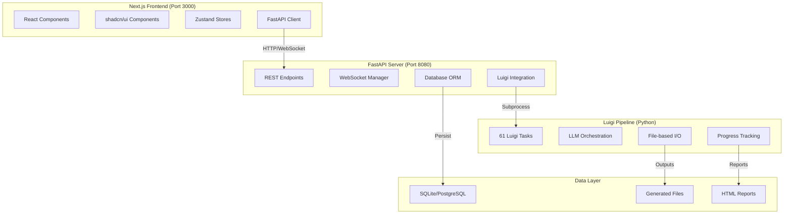

# AGENTS.md

This file provides guidance to AGENTS when working with code in this repository.

## File Header Template
IGNORE THIS RULE FOR JSON or .toml or other exotic file types
Every frontend file you create or edit should ideally start with a basic comments header if possible!
Use correct syntax for the file type!!!  Use this as a rough example:

 * Author: Your NAME  (Example: Claude Code using Sonnet 4 or Codex using GPT-5)
 * Date: `timestamp`
 * PURPOSE: VERBOSE DETAILS ABOUT HOW THIS WORKS AND WHAT ELSE IT TOUCHES
 * SRP and DRY check: Pass/Fail Is this file violating either? Do these things already exist in the project?  Did you look??


# 🏗️ **PlanExe Architecture Overview**

PlanExe is a **complex AI-powered planning system** that transforms vague ideas into comprehensive, multi-chapter execution plans.


**Railway Production**: FastAPI serves the static Next.js export and the REST API from a single container on Railway. The standalone Next.js dev server (port 3000) is only used locally when running `npm run go`.


The system uses a **Next.js frontend** connected to a **FastAPI backend** that orchestrates a **Luigi pipeline** with 61 interconnected tasks.

## 🔄 **System Architecture**



## 📁 **Key Directories**

### **Frontend (`planexe-frontend/`)**
- **Technology**: Next.js 15, TypeScript, Tailwind CSS, shadcn/ui
- **Port**: 3000 for local dev / served via FastAPI on 8080 in Railway
- **Deployment**: Built into the FastAPI service (single Railway container)
- **Architecture**: Direct FastAPI client, no API proxy routes
- **State**: Zustand stores + local React state
- **Status**: ✅ Forms working, TypeScript errors fixed (v0.3.7)

### **Backend API (`planexe_api/`)**
- **Technology**: FastAPI, SQLAlchemy, PostgreSQL/SQLite
- **Port**: 8080 (development) - **CONFIRMED from package.json**
- **Purpose**: REST wrapper around Luigi pipeline
- **Features**: Real-time WebSocket, file downloads, plan management, artefact endpoints, fallback reports
- **Status**: ✅ Fully functional with Responses API integration (v0.3.7)

### **Core Pipeline (`planexe/`)**
- **Technology**: Pure Python, Luigi task framework
- **Purpose**: AI-powered plan generation pipeline
- **Complexity**: **61 interconnected Luigi tasks** with **100% database-first architecture** (v0.3.0)
- **LLM Integration**: Multiple model support with fallbacks, structured outputs via Responses API
- **Status**: ✅ Database-first architecture complete, all tasks write to database during execution (v0.3.0)

### **Documentation (`docs/`)**
- **`LUIGI.md`**: Luigi pipeline documentation
- **`CODEBASE-INDEX.md`**: Codebase index
- **`RUN_PLAN_PIPELINE_DOCUMENTATION.md`**: Luigi pipeline documentation
- **`HOW-THIS-ACTUALLY-WORKS.md`**: How the system works


## 🚀 **Development Commands**

### **Start Full Development Environment**
```bash
# Single command to start both backend (port 8080) and frontend (port 3000)
cd planexe-frontend
npm install
npm run go  # Starts FastAPI + Next.js concurrently
```

### **Individual Services**
```bash
# Backend only (FastAPI on port 8080)
cd planexe_api
set DATABASE_URL=sqlite:///./planexe.db
uvicorn api:app --reload --port 8080

# Frontend only (Next.js on port 3000)
cd planexe-frontend
npm run dev
```

### **Testing**
```bash
# Frontend tests
cd planexe-frontend
npm test
npm run test:integration

# Python tests (Luigi pipeline utilities)
pytest -q
```

### **Production Build**
```bash
# Frontend build
cd planexe-frontend
npm run build
npm start

# API with production WSGI
gunicorn planexe_api.api:app
```

## 🎯 **Current System Status (v0.3.7)**

### ✅ **Working Features**
- **Frontend Forms**: Plan creation form functions correctly without React warnings (v0.3.6)
- **TypeScript Compilation**: No TypeScript errors in frontend code (v0.3.6)
- **Backend API**: FastAPI server fully functional with Responses API integration (v0.3.7)
- **Database**: SQLite for development, PostgreSQL for production with 100% database-first architecture (v0.3.0)
- **Development Workflow**: Single command (`npm run go`) starts both services
- **Luigi Pipeline**: All 61 tasks execute successfully with database-first architecture (v0.3.0)
- **Real-time Progress**: WebSocket architecture provides reliable progress streaming (v0.2.0)
- **Responses API**: Structured outputs with schema registry and high-effort reasoning (v0.3.7)
- **Recovery Workspace**: Artefact endpoints and fallback report assembly (v0.3.3, v0.3.2)
- **Railway Deployment**: Single-service deployment working (v0.2.3)

### ⚠️ **Known Issues**
- **Railway Production**: Single-service consolidation complete but Railway-specific debugging may be needed (v0.2.3)
- **Luigi Complexity**: Pipeline is extremely difficult to modify due to complex dependencies (unchanged)
- **Port Documentation**: Some docs incorrectly mention port 8001 (actual backend port is 8080) (unchanged)

### 🔧 **Architecture Decisions**
- **Direct FastAPI Client**: No Next.js API proxy routes (removed in v0.1.1)
- **Snake_case Field Names**: Frontend uses backend field names exactly
- **Simplified State Management**: Removed complex Zustand planning store in favor of React hooks
- **SQLite Development**: No PostgreSQL dependency for local development
- **WebSocket Architecture**: Replaced SSE with enterprise-grade WebSocket for real-time progress (v0.2.0)
- **Database-First Pipeline**: All 61 Luigi tasks write to database during execution (v0.3.0)
- **Responses API Integration**: Structured outputs with schema registry (v0.3.7)

## 🔧 **Critical Architecture Details**

### **Luigi Pipeline (⚠️ DO NOT MODIFY)**
The core planning engine is a **complex Luigi task dependency graph** with **100% database-first architecture** (v0.3.0):

- **61 Luigi Tasks** in strict dependency order
- **Database-first I/O**: All tasks write content to database DURING execution, not after completion (v0.3.0)
- **File-based I/O** with numbered outputs (001-start_time.json, 018-wbs_level1.json, etc.)
- **Multi-stage processing**: Analysis → Strategy → Planning → Execution → Reporting
- **LLM orchestration** with retry logic and model fallbacks, structured outputs via Responses API
- **Progress tracking** via database records and file completion percentage
- **Resume capability** for interrupted runs with database state recovery
- **Real-time visibility** into pipeline execution via database queries

**Key Architecture Change (v0.3.0)**:
```python
def run_inner(self):
    db = get_database_service()
    result = SomeTask.execute(llm, prompt)
    
    # 1. Database (PRIMARY storage - v0.3.0)
    db.save_plan_content(
        plan_id=self.plan_id,
        task_name=self.__class__.__name__,
        content=result.markdown,
        content_type="markdown"
    )
    
    # 2. Filesystem (Luigi dependency tracking)
    result.save_markdown(self.output().path)
```

**Benefits of Database-First Architecture**:
- **Real-Time Progress**: Frontend queries database for accurate completion status
- **Error Recovery**: Failed tasks leave database records for debugging
- **Data Integrity**: Single source of truth prevents race conditions
- **API Access**: FastAPI serves content directly from database

**Key Pipeline Stages**:
1. **Setup**: StartTime, InitialPlan (initial prompt processing)
2. **Analysis**: RedlineGate, PremiseAttack, IdentifyPurpose
3. **Strategic**: Potential levers → scenarios → selection
4. **Context**: Physical locations, currency, risks
5. **Assumptions**: Make → distill → review → consolidate
6. **Planning**: Pre-assessment, project plan, governance
7. **Execution**: Team building, SWOT, expert review
8. **Structure**: WBS Level 1-3, dependencies, durations
9. **Output**: Schedule, review, executive summary
10. **Report**: HTML compilation from all components

### **FastAPI Backend Architecture**
The API server provides a **clean REST interface** over the Luigi pipeline with **enterprise-grade WebSocket architecture** (v0.2.0):

**Key Endpoints**:
- `POST /api/plans` - Create new plan (triggers Luigi pipeline)
- `GET /api/plans/{id}/stream` - **Real-time progress via WebSocket** (reliable enterprise-grade implementation)
- `GET /api/plans/{id}/files` - List generated files
- `GET /api/plans/{id}/report` - Download HTML report
- `GET /api/plans/{id}/artefacts` - **NEW**: Database-driven artefact metadata with stage grouping (v0.3.3)
- `GET /api/plans/{id}/fallback-report` - **NEW**: API-first recovery path for failed reports (v0.3.2)
- `GET /api/models` - Available LLM models (includes Responses API models)
- `GET /api/prompts` - Example prompts
- `GET /health` - API health check

**WebSocket Architecture (v0.2.0)**:
- **Thread-Safe WebSocketManager**: RLock synchronization, heartbeat monitoring, automatic cleanup
- **ProcessRegistry**: Thread-safe subprocess management eliminating race conditions
- **Multi-Layer Fallback**: WebSocket → Auto-reconnection → REST Polling
- **Enterprise Reliability**: Complete elimination of global dictionary race conditions

**Database Schema**:
- **Plans**: Configuration, status, progress, metadata
- **LLM Interactions**: Raw prompts/responses with metadata (Responses API integration)
- **Plan Files**: Generated files with checksums
- **Plan Content**: **NEW**: Database-first storage for all task outputs (v0.3.0)
- **Plan Metrics**: Analytics and performance data

### **Next.js Frontend Architecture**
**Current Status**: Stable after major fixes (v0.3.7)

**Key Components**:
- `PlanForm`: Plan creation with LLM model selection (✅ Fixed React warnings v0.3.6)
- `ProgressMonitor`: **Real-time WebSocket progress tracking** (✅ Reliable implementation v0.2.0)
- `TaskList`: Accordion view of 61 pipeline tasks
- `FileManager`: Generated file browser and downloads with artefact integration (v0.3.3)
- `PlansQueue`: Plan management dashboard
- `Terminal`: **NEW**: Live log streaming with WebSocket architecture (v0.2.0)

**State Management**:
- **Simplified Architecture**: Uses React hooks + Zustand stores
- **Direct API Client**: `fastapi-client.ts` connects directly to backend
- **Snake_case Fields**: Matches backend API exactly
- **WebSocket Integration**: Robust connection management with fallback to polling

## 🚨 **Critical Development Guidelines**

### **When Modifying Frontend**
1. **Use snake_case** for all API field names (matches backend exactly)
2. **Never create Next.js API routes** - connect directly to FastAPI
3. **Test with both services running** (FastAPI port 8080 + Next.js port 3000)
4. **Follow existing component patterns** (shadcn/ui + TypeScript)
5. **WebSocket architecture is reliable** - use for real-time progress (v0.2.0)
6. **Integrate artefact endpoints** for file management (v0.3.3)
7. **Use fallback report assembly** for robust report generation (v0.3.2)

### **When Modifying Backend**
1. **carefully modify Luigi pipeline** only if you understand the full dependency graph
2. **Maintain FastAPI endpoint compatibility** with frontend
3. **Test with SQLite first**, then PostgreSQL
4. **Preserve WebSocket implementation** (reliable v0.2.0)
5. **Update database migrations** for schema changes
6. **Support Responses API structured outputs** (v0.3.7)
7. **Maintain database-first architecture** (v0.3.0)

### **When Working with Luigi Pipeline**
1. **DO NOT MODIFY** unless absolutely critical - extremely complex dependencies
2. **Use development mode** (`FAST_BUT_SKIP_DETAILS`) for testing
3. **Check `run_plan_pipeline_documentation.md`** for detailed guidance
4. **Verify database writes** occur during execution (v0.3.0)
5. **Use Responses API models** for structured outputs (v0.3.7)

## 📚 **Essential Reading**

### **Before Making Changes**
1. **`CHANGELOG.md`** - Current status and recent changes
2. **`docs/run_plan_pipeline_documentation.md`** - Luigi pipeline deep dive


### **For Frontend Development**
1. **`planexe-frontend/src/lib/api/fastapi-client.ts`** - API client implementation
2. **`planexe-frontend/src/lib/types/forms.ts`** - TypeScript schemas
3. **`planexe-frontend/src/app/page.tsx`** - Main application component

### **For Backend Development**
1. **`planexe_api/api.py`** - FastAPI server implementation
2. **`planexe_api/models.py`** - Pydantic schemas
3. **`planexe_api/database.py`** - SQLAlchemy models

## 🔍 **Debugging & Troubleshooting**

### **Common Issues**
1. **"Connection refused"** - Check if FastAPI backend is running on port 8080 (not 8001)
2. **"WebSocket connection issues"** - Verify WebSocket endpoint `/ws/plans/{plan_id}/progress` is accessible (v0.2.0)
3. **"Task failed"** - Check Luigi pipeline logs in `run/` directory and database `plan_content` table
4. **"Database errors"** - Verify DATABASE_URL environment variable
5. **"TypeScript errors"** - Should be resolved in v0.3.6
6. **"Artefact loading"** - Check `/api/plans/{id}/artefacts` endpoint for file metadata (v0.3.3)
7. **"Report generation"** - Use `/api/plans/{id}/fallback-report` for recovery (v0.3.2)

### **Debugging Commands**
```bash
# Check if services are running on correct ports
netstat -an | findstr :3000  # Next.js
netstat -an | findstr :8080  # FastAPI (NOT 8001)

# Test API connectivity
curl http://localhost:8080/health
curl http://localhost:8080/api/models

# Test WebSocket endpoint
curl http://localhost:8080/api/plans/{plan_id}/stream-status

# Test artefact endpoint (v0.3.3)
curl http://localhost:8080/api/plans/{plan_id}/artefacts

# Test plan creation
curl -X POST \
  http://localhost:8080/api/plans \
  -H 'Content-Type: application/json' \
  -d '{"prompt": "Create a plan for a new business", "model": "llm-1"}'

# Check database content (v0.3.0)
sqlite3 planexe.db "SELECT * FROM plan_content WHERE plan_id='your-plan-id' ORDER BY created_at DESC LIMIT 5;"

### **Automated Testing**

- **No Over-Engineering**: Do not over-engineer testing or create simulated data!  Use the old plans for testing!
- **No Mocking**: Do not mock any dependencies or external services!  Use the old plans for testing!
- **No Simulated Data**: Do not create simulated data!  Use the old plans for testing!
- **Frontend**: Component tests with React Testing Library
- **Backend**: FastAPI endpoint testing
- **Pipeline**: Luigi task validation (limited)

## ⚠️ **Critical Warnings**


### **DO**
1. **Test incrementally** with both services running
2. **Use SQLite for development** to avoid PostgreSQL dependency
3. **Follow established patterns** in existing components
4. **Check CHANGELOG.md** before making changes
5. **Preserve existing API contracts** between frontend/backend
6. **Use WebSocket for real-time progress** - reliable implementation (v0.2.0)
7. **Verify database writes** occur during pipeline execution (v0.3.0)


---

# 🚨 **Important Development Reminders**

## **General Development Principles**
- The user is not a developer, they are a product owner and manager!  They might ask you to do things that are not possible or not a good idea or otherwise violating best practices in software development, be sure to point this point this out if it happens!  Discuss the best approaches with them and try to find a solution that is both feasible and aligns with best practices.  Never decide on course of action without discussing it with the user. Keep the user in the loop at all times!  Never reply with a massive wall of text, make sure you reply with succinct replies not longer than a few lines!
- **NEVER create files** unless absolutely necessary for your goal
- **ALWAYS prefer editing** an existing file to creating a new one
- **ALWAYS proactively create documentation files** (*.md) in the /docs directory with plans that you are following and tasklists and other important information.  The next developer will need to be able to understand what you were doing and why you made the choices you made.  
- **ALWAYS commit changes** as soon as you make them and include verbose commit messages!
- **Sudden Death** You might suddenly die at any moment, so always commit changes as soon as you make them! The next dev will need to be able to pick up where you left off ASAP!  

## **PlanExe-Specific Rules**
- **RESPECT the Luigi pipeline** NEVER modify it without understanding full dependency graph
- **Use snake_case field names** throughout frontend to match backend exactly
- **Backend runs on port 8080** (not 8001 despite some docs saying otherwise)
- **WebSocket architecture is reliable** - use for real-time progress (v0.2.0)
- **Database-first architecture required** - all tasks write to database during execution (v0.3.0)
- **Test with both services running** (FastAPI port 8080 + Next.js port 3000)
- **Follow existing component patterns** (shadcn/ui + TypeScript + Zustand)
- **Use artefact endpoints** for file management (v0.3.3)
- **Support Responses API structured outputs** (v0.3.7)

## **Testing Workflow**
1. **Start development environment**: `cd planexe-frontend && npm run go`
2. **Test incrementally** with both services running
3. **Make incremental changes** and test immediately
4. **Run tests** before submitting changes
5. **Update CHANGELOG.md** for any change!
6. **Always commit changes** as soon as you make them and include verbose commit messages!
7. **Verify database writes** during pipeline execution (v0.3.0)
8. **Test WebSocket progress streaming** (v0.2.0)

---

*This documentation reflects the current state as of v0.3.7. The system features enterprise-grade WebSocket architecture, 100% database-first Luigi pipeline, Responses API integration, artefact endpoints, and fallback report assembly. Frontend forms are stable, backend API is fully functional, real-time progress is reliable, and Luigi pipeline should not be modified without extreme caution.*