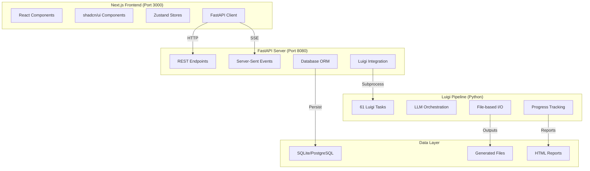

# CLAUDE.md

This file provides guidance to Claude Code (claude.ai/code) when working with code in this repository.

## File Header Template
Every file you create or edit should start with:
```
/**
 * Author: Your NAME  (Example: Claude Code using Sonnet 4)
 * Date: `timestamp`
 * PURPOSE: VERBOSE DETAILS ABOUT HOW THIS WORKS AND WHAT ELSE IT TOUCHES
 * SRP and DRY check: Pass/Fail Is this file violating either? Do these things already exist in the project?  Did you look??
 */
```

# 🏗️ **PlanExe Architecture Overview**

PlanExe is a **complex AI-powered planning system** that transforms vague ideas into comprehensive, multi-chapter execution plans. The system uses a **Next.js frontend** connected to a **FastAPI backend** that orchestrates a **Luigi pipeline** with 61 interconnected tasks.

## 🔄 **System Architecture**



## 📁 **Key Directories**

### **Frontend (`planexe-frontend/`)**
- **Technology**: Next.js 15, TypeScript, Tailwind CSS, shadcn/ui
- **Port**: 3000 (development)
- **Architecture**: Direct FastAPI client, no API proxy routes
- **State**: Zustand stores + local React state
- **Status**: ✅ Forms working, TypeScript errors fixed (v0.1.4)

### **Backend API (`planexe_api/`)**
- **Technology**: FastAPI, SQLAlchemy, PostgreSQL/SQLite
- **Port**: 8000 (development) - **CONFIRMED from package.json**
- **Purpose**: REST wrapper around Luigi pipeline
- **Features**: Real-time SSE, file downloads, plan management
- **Status**: ✅ Fully functional with enhanced logging (v0.1.4)

### **Core Pipeline (`planexe/`)**
- **Technology**: Pure Python, Luigi task framework
- **Purpose**: AI-powered plan generation pipeline
- **Complexity**: **61 interconnected Luigi tasks** (confirmed from changelog)
- **LLM Integration**: Multiple model support with fallbacks
- **Status**: ⚠️ Stable but extremely complex - DO NOT MODIFY

### **Documentation (`docs/`)**
- **`run_plan_pipeline_documentation.md`**: Complete Luigi pipeline documentation
- **`FRONTEND-ARCHITECTURE-FIX-PLAN.md`**: Frontend architecture decisions
- **`19092025-NextJS-Implementation-Plan.md`**: Implementation strategy

## 🚀 **Development Commands**

### **Start Full Development Environment**
```bash
# Single command to start both backend (port 8000) and frontend (port 3000)
cd planexe-frontend
npm install
npm run go  # Starts FastAPI + Next.js concurrently
```

### **Individual Services**
```bash
# Backend only (FastAPI on port 8000)
cd planexe_api
set DATABASE_URL=sqlite:///./planexe.db
uvicorn api:app --reload --port 8000

# Frontend only (Next.js on port 3000)
cd planexe-frontend
npm run dev
```

### **Testing**
```bash
# Frontend tests
cd planexe-frontend
npm test
npm run test:integration

# Python tests (Luigi pipeline utilities)
pytest -q
```

### **Production Build**
```bash
# Frontend build
cd planexe-frontend
npm run build
npm start

# API with production WSGI
gunicorn planexe_api.api:app
```

## 🎯 **Current System Status (v0.1.4)**

### ✅ **Working Features**
- **Frontend Forms**: Plan creation form functions correctly without React warnings
- **TypeScript Compilation**: No TypeScript errors in frontend code
- **Backend API**: FastAPI server fully functional with enhanced logging
- **Database**: SQLite for development, PostgreSQL for production
- **Development Workflow**: Single command (`npm run go`) starts both services
- **Luigi Pipeline**: All 61 tasks execute successfully for plan generation

### ⚠️ **Known Issues**
- **Real-time Progress**: SSE streaming still has reliability issues (v0.1.3 marked as "NOT REALLY Fixed")
- **Port Documentation**: Some docs incorrectly mention port 8001 (actual backend port is 8000)
- **Luigi Complexity**: Pipeline is extremely difficult to modify due to complex dependencies

### 🔧 **Architecture Decisions**
- **Direct FastAPI Client**: No Next.js API proxy routes (removed in v0.1.1)
- **Snake_case Field Names**: Frontend uses backend field names exactly
- **Simplified State Management**: Removed complex Zustand planning store in favor of React hooks
- **SQLite Development**: No PostgreSQL dependency for local development

## 🔧 **Critical Architecture Details**

### **Luigi Pipeline (⚠️ DO NOT MODIFY)**
The core planning engine is a **complex Luigi task dependency graph**:
- **61 Luigi Tasks** in strict dependency order
- **File-based I/O** with numbered outputs (001-start_time.json, 018-wbs_level1.json, etc.)
- **Multi-stage processing**: Analysis → Strategy → Planning → Execution → Reporting
- **LLM orchestration** with retry logic and model fallbacks
- **Progress tracking** via file completion percentage
- **Resume capability** for interrupted runs

**Key Pipeline Stages**:
1. **Setup**: StartTime, InitialPlan (initial prompt processing)
2. **Analysis**: RedlineGate, PremiseAttack, IdentifyPurpose
3. **Strategic**: Potential levers → scenarios → selection
4. **Context**: Physical locations, currency, risks
5. **Assumptions**: Make → distill → review → consolidate
6. **Planning**: Pre-assessment, project plan, governance
7. **Execution**: Team building, SWOT, expert review
8. **Structure**: WBS Level 1-3, dependencies, durations
9. **Output**: Schedule, review, executive summary
10. **Report**: HTML compilation from all components

### **FastAPI Backend Architecture**
The API server provides a **clean REST interface** over the Luigi pipeline:

**Key Endpoints**:
- `POST /api/plans` - Create new plan (triggers Luigi pipeline)
- `GET /api/plans/{id}/stream` - **Real-time progress via SSE** (has known issues)
- `GET /api/plans/{id}/files` - List generated files
- `GET /api/plans/{id}/report` - Download HTML report
- `GET /api/models` - Available LLM models
- `GET /api/prompts` - Example prompts
- `GET /health` - API health check

**Database Schema**:
- **Plans**: Configuration, status, progress, metadata
- **LLM Interactions**: Raw prompts/responses with metadata
- **Plan Files**: Generated files with checksums
- **Plan Metrics**: Analytics and performance data

### **Next.js Frontend Architecture**
**Current Status**: Stable after major fixes (v0.1.4)

**Key Components**:
- `PlanForm`: Plan creation with LLM model selection (✅ Fixed React warnings)
- `ProgressMonitor`: Real-time SSE progress tracking (⚠️ Still has issues)
- `TaskList`: Accordion view of 61 pipeline tasks
- `FileManager`: Generated file browser and downloads
- `PlansQueue`: Plan management dashboard

**State Management**:
- **Simplified Architecture**: Uses React hooks + Zustand stores
- **Direct API Client**: `fastapi-client.ts` connects directly to backend
- **Snake_case Fields**: Matches backend API exactly

## 🚨 **Critical Development Guidelines**

### **When Modifying Frontend**
1. **Use snake_case** for all API field names (matches backend exactly)
2. **Never create Next.js API routes** - connect directly to FastAPI
3. **Test with both services running** (FastAPI port 8000 + Next.js port 3000)
4. **Follow existing component patterns** (shadcn/ui + TypeScript)
5. **Be aware SSE streaming has known issues** - don't assume it works perfectly

### **When Modifying Backend**
1. **NEVER modify Luigi pipeline** unless you understand the full dependency graph
2. **Maintain FastAPI endpoint compatibility** with frontend
3. **Test with SQLite first**, then PostgreSQL
4. **Preserve existing SSE implementation** (even though it has issues)
5. **Update database migrations** for schema changes

### **When Working with Luigi Pipeline**
1. **DO NOT MODIFY** unless absolutely critical - extremely complex dependencies
2. **Use development mode** (`FAST_BUT_SKIP_DETAILS`) for testing
3. **Check `run_plan_pipeline_documentation.md`** for detailed guidance
4. **Monitor memory usage** - pipeline can be resource-intensive
5. **Test with multiple LLM models** to ensure fallback logic works

## 📚 **Essential Reading**

### **Before Making Changes**
1. **`CHANGELOG.md`** - Current status and recent changes
2. **`docs/run_plan_pipeline_documentation.md`** - Luigi pipeline deep dive
3. **`docs/FRONTEND-ARCHITECTURE-FIX-PLAN.md`** - Frontend architecture decisions

### **For Frontend Development**
1. **`planexe-frontend/src/lib/api/fastapi-client.ts`** - API client implementation
2. **`planexe-frontend/src/lib/types/forms.ts`** - TypeScript schemas
3. **`planexe-frontend/src/app/page.tsx`** - Main application component

### **For Backend Development**
1. **`planexe_api/api.py`** - FastAPI server implementation
2. **`planexe_api/models.py`** - Pydantic schemas
3. **`planexe_api/database.py`** - SQLAlchemy models

## 🔍 **Debugging & Troubleshooting**

### **Common Issues**
1. **"Connection refused"** - Check if FastAPI backend is running on port 8000 (not 8001)
2. **"Real-time progress not updating"** - Known issue with SSE streaming reliability
3. **"Task failed"** - Check Luigi pipeline logs in `run/` directory
4. **"Database errors"** - Verify DATABASE_URL environment variable
5. **"TypeScript errors"** - Should be resolved in v0.1.4

### **Debugging Commands**
```bash
# Check if services are running on correct ports
netstat -an | findstr :3000  # Next.js
netstat -an | findstr :8000  # FastAPI (NOT 8001)

# View recent logs
tail -f planexe_api/log.txt
tail -f run/*/log.txt

# Test API connectivity
curl http://localhost:8000/health
curl http://localhost:8000/api/models

# Test plan creation
curl -X POST \
  http://localhost:8000/api/plans \
  -H 'Content-Type: application/json' \
  -d '{"prompt": "Create a plan for a new business", "model": "llm-1"}'
- [ ] LLM models load correctly (http://localhost:8000/api/models)
- [ ] Plan creation form works without React warnings
- [ ] Plan creation triggers Luigi pipeline
- [ ] Real-time progress shows (may be unreliable)
- [ ] Generated files are accessible
- [ ] HTML report generation completes

### **Automated Testing**
- **Old Plans**: D:\1Projects\PlanExe\run has logs of failed runs!!  use it for testing!!!  Do not make fake data!
- **No Over-Engineering**: Do not over-engineer testing or create simulated data!  Use the old plans for testing!
- **No Mocking**: Do not mock any dependencies or external services!  Use the old plans for testing!
- **No Simulated Data**: Do not create simulated data!  Use the old plans for testing!
- **Frontend**: Component tests with React Testing Library
- **Backend**: FastAPI endpoint testing
- **Pipeline**: Luigi task validation (limited)

## ⚠️ **Critical Warnings**

### **DO NOT**
1. **Modify Luigi pipeline** without deep understanding of 61-task dependency graph
2. **Assume real-time progress works perfectly** - known reliability issues
3. **Use port 8001** - backend actually runs on port 8000
4. **Create Next.js API proxy routes** - use direct FastAPI client
5. **Ignore TypeScript errors** - should be clean in v0.1.4

### **DO**
1. **Test incrementally** with both services running
2. **Use SQLite for development** to avoid PostgreSQL dependency
3. **Follow established patterns** in existing components
4. **Check CHANGELOG.md** before making changes
5. **Preserve existing API contracts** between frontend/backend


---

# 🚨 **Important Development Reminders**

## **General Development Principles**
- The user is not a developer, they are a product owner and manager!  They might ask you to do things that are not possible or not a good idea or otherwise violating best practices in software development, be sure to point this point this out if it happens!  Discuss the best approaches with them and try to find a solution that is both feasible and aligns with best practices.  Never decide on course of action without discussing it with the user.
- **NEVER create files** unless absolutely necessary for your goal
- **ALWAYS prefer editing** an existing file to creating a new one
- **ALWAYS proactively create documentation files** (*.md) in the /docs directory with plans that you are following and tasklists and other important information.  The next developer will need to be able to understand what you were doing and why you made the choices you made.  
- **ALWAYS commit changes** as soon as you make them and include verbose commit messages!
- **Sudden Death** You might suddenly die at any moment, so always commit changes as soon as you make them! The next dev will need to be able to pick up where you left off ASAP!  

## **PlanExe-Specific Rules**
- **NEVER modify the Luigi pipeline** without understanding full dependency graph
- **Use snake_case field names** throughout frontend to match backend exactly
- **Backend runs on port 8000** (not 8001 despite some docs saying otherwise)
- **Real-time progress has known issues** - don't assume SSE streaming is reliable
- **Test with both services running** (FastAPI port 8000 + Next.js port 3000)
- **Follow existing component patterns** (shadcn/ui + TypeScript + Zustand)

## **Testing Workflow**
1. **Start development environment**: `cd planexe-frontend && npm run go`
2. **Verify services**: http://localhost:3000 (frontend) + http://localhost:8000/health (backend)
3. **Make incremental changes** and test immediately
4. **Run tests** before submitting changes
5. **Update CHANGELOG.md** for any change!
6. **Always commit changes** as soon as you make them and include verbose commit messages!

---

*This documentation reflects the current state as of v0.1.4. The system is complex with known issues in real-time progress monitoring. Frontend forms are stable, backend API is fully functional, but Luigi pipeline should not be modified without extreme caution.*