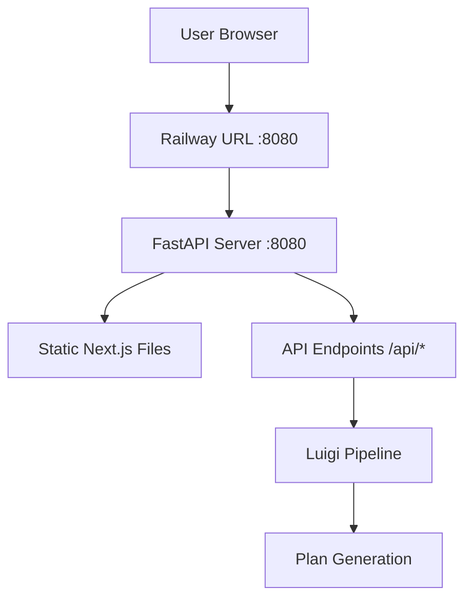

/**
 * Author: Claude Code using Sonnet 4
 * Date: 2025-09-26
 * PURPOSE: Documentation for fixing Railway deployment AI model selection issue by standardizing port usage to 8080
 * SRP and DRY check: Pass - Single responsibility for documenting Railway port standardization fix
 */

# Railway Deployment AI Model Selection Fix - Port Standardization

## Issue Summary
**Problem**: AI model selection dropdown is not working in Railway deployment.

**Root Cause**: Port mismatch between development (8000) and production (8080) environments, combined with hardcoded localhost:8000 URLs throughout the frontend codebase.

**Solution**: Standardize on port 8080 for both development and production environments to eliminate port inconsistencies.

## Current Architecture Problems

### Development Mode (Current)
- **Frontend**: Next.js on port 3000
- **Backend**: FastAPI on port 8000
- **API Calls**: Hardcoded to `http://localhost:8000`

### Production Mode (Railway)
- **Single Service**: FastAPI on port 8080 (serves both frontend static files and API)
- **API Calls**: Should use relative paths or port 8080
- **Problem**: Frontend still tries to call `http://localhost:8000` which doesn't exist

## Files with Hardcoded Port 8000 URLs

### Critical Files (11 total):
1. `planexe-frontend/src/lib/stores/config.ts:89` - **Model loading endpoint**
2. `planexe-frontend/src/components/PipelineDetails.tsx:52`
3. `planexe-frontend/src/components/PlansQueue.tsx:41,57`
4. `planexe-frontend/src/components/monitoring/ProgressMonitor.tsx:38`
5. `planexe-frontend/src/components/monitoring/Terminal.tsx:63,85`
6. `planexe-frontend/src/lib/stores/planning.ts:108,151,246`
7. `planexe-frontend/src/lib/api/fastapi-client.ts:65,66,68`
8. `planexe-frontend/next.config.ts:12`

### Development Scripts:
- `planexe-frontend/package.json` - `dev:backend` and `go` scripts use port 8000

## Solution: Port 8080 Standardization

### Benefits of This Approach:
1. **Eliminates Environment Differences**: Same port for dev and prod
2. **Simplifies Configuration**: No environment-specific logic needed
3. **Matches Railway Architecture**: Already uses 8080 in production
4. **Reduces Complexity**: No need for complex baseURL detection logic

### Implementation Plan

#### Phase 1: Update Development Configuration
- [ ] Update `package.json` scripts to use port 8080
- [ ] Update `next.config.ts` default API URL to 8080
- [ ] Update `FastAPIClient` default port to 8080

#### Phase 2: Replace All Hardcoded URLs
- [ ] Replace all `localhost:8000` references with `localhost:8080`
- [ ] Update config store model loading endpoint
- [ ] Update all component API calls
- [ ] Update planning store endpoints

#### Phase 3: Testing & Validation
- [ ] Test local development on port 8080
- [ ] Verify model selection works locally
- [ ] Confirm Railway deployment unchanged (already uses 8080)
- [ ] Test all API endpoints function correctly

## Technical Details

### Current FastAPIClient Logic (Complex):
```typescript
const isDevelopment = process.env.NODE_ENV === 'development' ||
                     process.env.NEXT_PUBLIC_API_URL === 'http://localhost:8000';
this.baseURL = isDevelopment ? 'http://localhost:8000' : '';
```

### New Simplified Logic:
```typescript
// Always use 8080 for consistency
this.baseURL = process.env.NODE_ENV === 'development' ? 'http://localhost:8080' : '';
```

### Package.json Changes:
```json
// Before:
"dev:backend": "python -m uvicorn planexe_api.api:app --reload --port ${PORT:-8000}",
"go": "concurrently \"cd .. && python -m uvicorn planexe_api.api:app --reload --port ${PORT:-8000}\" ...",

// After:
"dev:backend": "python -m uvicorn planexe_api.api:app --reload --port ${PORT:-8080}",
"go": "concurrently \"cd .. && python -m uvicorn planexe_api.api:app --reload --port ${PORT:-8080}\" ...",
```

## Railway Deployment Architecture (Unchanged)

The Railway deployment already uses the correct architecture:



This fix ensures local development matches this production architecture exactly.

## Environment Variables

### Current:
- `NEXT_PUBLIC_API_URL=http://localhost:8000` (development)
- `PORT=8080` (Railway automatically provides this)

### After Fix:
- `NEXT_PUBLIC_API_URL=http://localhost:8080` (development)
- `PORT=8080` (Railway, unchanged)

## Testing Checklist

### Local Development (Post-Fix):
- [ ] `npm run go` starts backend on port 8080
- [ ] Frontend connects to `http://localhost:8080/api/models`
- [ ] Model selection dropdown populates correctly
- [ ] Plan creation works end-to-end
- [ ] All API endpoints respond correctly

### Railway Deployment:
- [ ] No changes needed (already uses 8080)
- [ ] Model selection works in production
- [ ] All functionality preserved

## Migration Steps for Developers

1. **Stop existing development servers**
2. **Pull latest changes with port fixes**
3. **Clear browser cache** (to avoid cached API calls to port 8000)
4. **Run `npm run go`** - backend now starts on 8080
5. **Verify** `http://localhost:8080/health` works
6. **Test** model selection in frontend

## Risks & Mitigations

### Potential Issues:
1. **Developer Confusion**: Port change in development
2. **Browser Cache**: Cached requests to port 8000
3. **Documentation**: Other docs may reference port 8000

### Mitigations:
- [ ] Update all documentation to reference 8080
- [ ] Clear instructions for developers
- [ ] Update CLAUDE.md with new port references
- [ ] Test thoroughly before merging

## Success Criteria

✅ **Primary Goal**: AI model selection works in Railway deployment
✅ **Secondary Goal**: Consistent port usage across all environments
✅ **Tertiary Goal**: Simplified configuration without environment detection complexity

## Files to Update

### Configuration Files:
- `planexe-frontend/package.json` (2 scripts)
- `planexe-frontend/next.config.ts` (1 line)
- `planexe-frontend/src/lib/api/fastapi-client.ts` (3 lines)

### Component Files:
- `planexe-frontend/src/lib/stores/config.ts` (1 line)
- `planexe-frontend/src/components/PipelineDetails.tsx` (1 line)
- `planexe-frontend/src/components/PlansQueue.tsx` (2 lines)
- `planexe-frontend/src/components/monitoring/ProgressMonitor.tsx` (1 line)
- `planexe-frontend/src/components/monitoring/Terminal.tsx` (2 lines)
- `planexe-frontend/src/lib/stores/planning.ts` (3 lines)

### Documentation Files:
- `CLAUDE.md` (update port references)
- `docs/HOW-THIS-ACTUALLY-WORKS.md` (update development section)

**Total**: ~18 line changes across 11 files

## Conclusion

This fix addresses the root cause of the Railway deployment issue by eliminating the port mismatch between development and production environments. By standardizing on port 8080 for both environments, we simplify the configuration and ensure the AI model selection works consistently across all deployment scenarios.

The changes are minimal but critical for Railway deployment functionality.