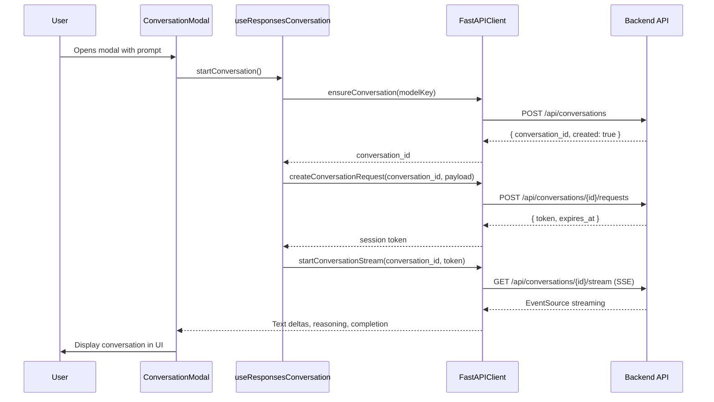

# ConversationModal Debugging Guide

## What I Fixed

### 1. **Visual Design** ✅
- Changed modal from partial viewport to **full viewport** (`h-screen w-screen`)
- Replaced all white backgrounds with **dark slate theme**:
  - Background: `slate-950`
  - Sections: `slate-900`
  - Messages: `slate-800` / `indigo-950/40`
  - Text: `slate-100/200/300/400`
- Reduced excessive padding and rounded corners
- Updated all accent colors for dark mode contrast

### 2. **Debug Logging** ✅
Added comprehensive console logging to trace the entire conversation flow:

**Files Modified:**
- `ConversationModal.tsx` - Modal lifecycle logging
- `useResponsesConversation.ts` - Conversation creation logging
- `fastapi-client.ts` - HTTP request/response logging

**What Gets Logged:**
```
[FastAPIClient] Initializing with base URL: http://localhost:8080
[ConversationModal] Modal opened, attempting to start conversation...
[ConversationModal] Initial prompt: "your prompt here"
[ConversationModal] Model: gpt-5-mini-2025-08-07
[ConversationModal] Session key: prompt-intake-123...
[ConversationModal] Starting conversation with Responses API...
[useResponsesConversation] Creating new conversation with model: gpt-5-mini-2025-08-07
[FastAPIClient] POST http://localhost:8080/api/conversations
[FastAPIClient] Request body: { model_key: "gpt-5-mini-2025-08-07" }
[FastAPIClient] Response status: 200 OK
[FastAPIClient] Response data: { conversation_id: "...", model_key: "...", created: true }
[ConversationModal] Conversation started successfully
```

## How to Debug

### Step 1: Open Browser DevTools
1. Press `F12` or right-click → "Inspect"
2. Go to the **Console** tab
3. Clear the console (`Ctrl+L`)

### Step 2: Trigger the Modal
1. Fill out the landing page form
2. Click "Start Planning Conversation"
3. Watch the console output

### Step 3: Check for Errors

#### ❌ **API Not Running**
```
[FastAPIClient] POST http://localhost:8080/api/conversations
Failed to fetch
```
**Solution:** Start the backend server:
```bash
cd planexe-frontend
npm run go
```

#### ❌ **STREAMING_ENABLED = false**
```
[FastAPIClient] Response status: 403 Forbidden
{ error: "STREAMING_DISABLED" }
```
**Solution:** Check environment variables, STREAMING_ENABLED should default to `true`

#### ❌ **Wrong API URL**
```
[FastAPIClient] Initializing with base URL: https://some-wrong-url.com
```
**Solution:** Check `NEXT_PUBLIC_API_URL` environment variable or ensure localhost detection works

#### ❌ **Model Not Available**
```
[FastAPIClient] Response status: 400 Bad Request
{ error: "Model key not found: gpt-5-mini-2025-08-07" }
```
**Solution:** Check `llm_config.json` and ensure the model exists

#### ❌ **CORS Error**
```
Access to fetch at 'http://localhost:8080/api/conversations' from origin 'http://localhost:3000' 
has been blocked by CORS policy
```
**Solution:** Backend CORS is configured for localhost:3000 in development. Check if backend is running.

## Backend Endpoints Required

The modal needs these Responses API endpoints (all exist in `planexe_api/api.py`):

1. **`POST /api/conversations`** - Create/ensure conversation
2. **`POST /api/conversations/{id}/requests`** - Create conversation turn session
3. **`GET /api/conversations/{id}/stream`** - SSE stream for responses
4. **`POST /api/conversations/{id}/finalize`** - Finalize conversation

All endpoints are protected by `STREAMING_ENABLED` flag.

## Expected Flow



## Quick Test Commands

### Check if Backend is Running
```bash
curl http://localhost:8080/health
```

### Check if Conversations Endpoint Works
```bash
curl -X POST http://localhost:8080/api/conversations \
  -H "Content-Type: application/json" \
  -d '{"model_key":"gpt-5-mini-2025-08-07"}'
```

### Check Available Models
```bash
curl http://localhost:8080/api/models
```

## Next Steps

1. **Start the dev servers** if not running:
   ```bash
   cd planexe-frontend
   npm run go
   ```

2. **Open the app** at http://localhost:3000

3. **Fill the landing form** and submit

4. **Watch the browser console** for the detailed logs

5. **Share the error logs** if it still doesn't work

The full viewport dark theme is now live, and detailed logging will show exactly where the conversation flow fails! 🚀
