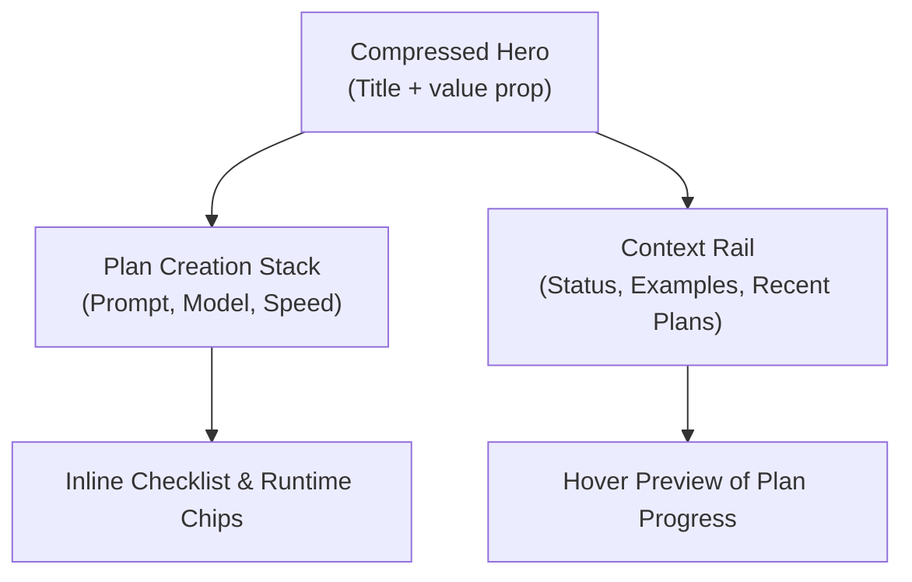

/**
 * Author: ChatGPT using GPT-5 Codex
 * Date: 2025-10-15
 * PURPOSE: Outline a phased redesign plan to tighten spacing, increase information density, and improve flow on the landing experience without sacrificing readability.
 * SRP and DRY check: Pass – the file documents a unique UX refinement plan not covered elsewhere after checking existing docs.
 */

# Landing Page Density & Flow Improvement Plan

## Goals
- Reduce excessive whitespace to create a focused, professional first impression.
- Increase simultaneous visibility of plan health, templates, and recent activity.
- Preserve accessibility (minimum touch targets, color contrast) while tightening layout rhythm.

## Current Pain Points
1. **Hero spacing dominates above the fold.** Large paddings push critical actions below the fold.
2. **Single-column card layout feels isolated.** Supporting context (examples, health status) hides behind tabs.
3. **Visual hierarchy skews playful.** Rounded corners and soft gradients read as “cartoonish” instead of enterprise.
4. **Prompt guidance requires multiple clicks.** Users cannot scan examples alongside form inputs.

## Design Principles
- Adopt an 8px spacing grid with max 24px outer gutters on desktop.
- Favor 4–6px corner radii for structural components; reserve 12px+ only for callouts.
- Pair neutral background tones with high-contrast accent separators to convey rigor.
- Keep critical metrics visible without scrolling using split-panel layout.

## Phased Execution

### Phase 1 – Layout Compression Audit
1. Inventory all `mt-`, `mb-`, `px-`, and `py-` utilities in `src/app/page.tsx`, `PlanForm`, and hero components.
2. Document current spacing values against new 8px rhythm targets.
3. Prototype tightened layout in Figma or Storybook using existing tokens.

### Phase 2 – Structural Refactor
1. Convert landing hero into **two-column grid** (action panel + context rail).
2. Extract `PlanForm` into a compact vertical stack with 16px internal padding.
3. Introduce a right-hand info rail containing:
   - Plan queue snapshot (3 most recent)
   - Model health status
   - Curated prompt examples (accordion)
4. Replace full-width gradient with subtle top border and neutral background.

### Phase 3 – Component Styling Updates
1. Normalize button and card radii to 6px; ensure hover states rely on color/weight rather than shadow blur.
2. Tighten typography scale: headings at 28/20px, body 16px, metadata 13px with uppercase labels.
3. Update `globals.css` spacing tokens to include `--space-xxs: 4px`, `--space-xs: 8px`, `--space-sm: 12px`, `--space-md: 16px`, `--space-lg: 24px`.
4. Audit icon usage; replace playful glyphs with thin-stroke alternatives where necessary.

### Phase 4 – Information Density Enhancements
1. Add inline validation + model readiness chips directly beneath the prompt field.
2. Surface estimated runtime + cost summary beside speed selector.
3. Embed collapsible “Quick start” checklist below the form with 12px padding.
4. Ensure recent plans list supports hover preview of stage progress without navigation.

### Phase 5 – QA & Iteration
1. Validate keyboard navigation after spacing adjustments.
2. Run responsive checks at 1440px, 1280px, 1024px, and 768px breakpoints, adjusting gutters.
3. Collect usability feedback focusing on perceived professionalism and clarity.
4. Prepare changelog entry summarizing visual refinements and density gains.

## Visual Flow Sketch

## Success Metrics
- Key CTA visible above the fold on 13" laptop without scrolling.
- At least three pieces of supporting info (health, examples, recent plans) visible concurrently.
- User survey shift toward "professional" aesthetic descriptors by ≥30%.
- Reduced average plan creation time by 15% due to inline guidance.

